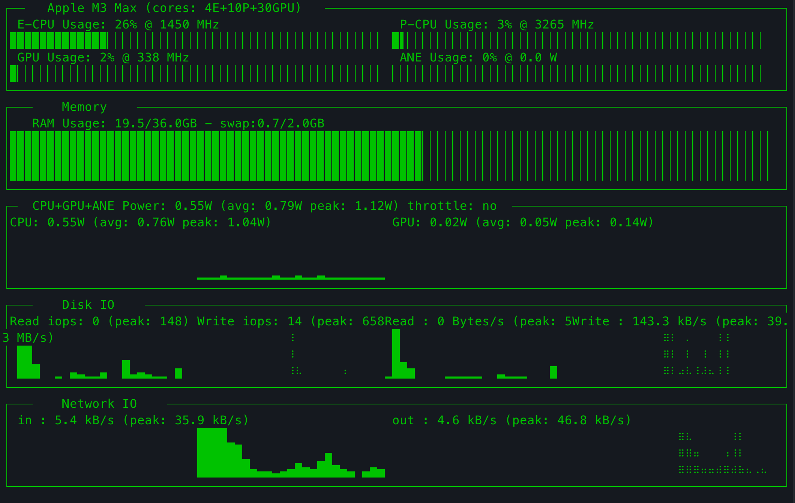

# macpm


Performance monitoring CLI tool for Apple Silicon



```shell
pip install macpm
```

## What is `macpm`

forked form https://github.com/tlkh/asitop
1. fixed problem that "E-CPU Usage" and "P-CPU Usage" always 100%
2. add "Disk IO" and "Network IO" info

A Python-based `nvtop`-inspired command line tool for Apple Silicon (aka M1) Macs.

* Utilization info:
  * CPU (E-cluster and P-cluster), GPU
  * Frequency and utilization
  * ANE utilization (measured by power)
* Memory info:
  * RAM and swap, size and usage
  * (Apple removed memory bandwidth from `powermetrics`)
* Power info:
  * CPU power, GPU power (Apple removed package power from `powermetrics`)
  * Chart for CPU/GPU power
  * Peak power, rolling average display

`macpm` uses the built-in [`powermetrics`](https://www.unix.com/man-page/osx/1/powermetrics/) utility on macOS, which allows access to a variety of hardware performance counters. Note that it requires `sudo` to run due to `powermetrics` needing root access to run. `macpm` is lightweight and has minimal performance impact.

**`macpm` only works on Apple Silicon Macs on macOS Monterey!**

## Installation and Usage

`macpm` is a Python-based command line tool. You need `pip` to download and install `macpm`. macOS already comes with Python, to install `pip`, you can follow an [online guide](https://phoenixnap.com/kb/install-pip-mac). After you install `macpm` via `pip`, you can use it via the Terminal.

```shell
# to enter password before start
# this mode is recommended!
sudo macpm

# it will prompt password on start
macpm

# advanced options
macpm [-h] [--interval INTERVAL] [--color COLOR] [--avg AVG]
optional arguments:
  -h, --help           show this help message and exit
  --interval INTERVAL  Display interval and sampling interval for powermetrics (seconds)
  --color COLOR        Choose display color (0~8)
  --avg AVG            Interval for averaged values (seconds)
```

## How it works

`powermetrics` is used to measure the following:

* CPU/GPU utilization via active residency
* CPU/GPU frequency
* Package/CPU/GPU/ANE energy consumption
* CPU/GPU/Media Total memory bandwidth via the DCS (DRAM Command Scheduler)

[`psutil`](https://github.com/giampaolo/psutil) is used to measure the following:

* memory and swap usage

[`sysctl`](https://developer.apple.com/library/archive/documentation/System/Conceptual/ManPages_iPhoneOS/man3/sysctl.3.html) is used to measure the following:

* CPU name
* CPU core counts

[`system_profiler`](https://ss64.com/osx/system_profiler.html) is used to measure the following:

* GPU core count

Some information is guesstimate and hardcoded as there doesn't seem to be a official source for it on the system:

* CPU/GPU TDP
* CPU/GPU maximum memory bandwidth
* ANE max power
* Media engine max bandwidth

## Why

Because I didn't find something like this online. Also, just curious about stuff.

## Disclaimers

I did this randomly don't blame me if it fried your new MacBook or something.
